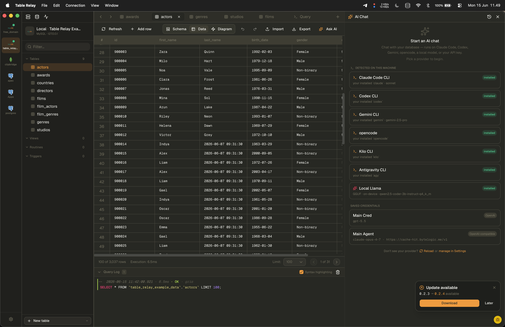

<div align="center">


# Table Relay

**A fast, multi-database desktop workbench** for browsing, querying, editing, and diagramming your data, with a built-in AI assistant that **cannot touch your database without your approval**.

One app for **MySQL · PostgreSQL · SQLite · MongoDB · Redis**, built with [Tauri](https://tauri.app) (Rust + React).

<a href="https://www.producthunt.com/products/table-relay?embed=true&amp;utm_source=badge-featured&amp;utm_medium=badge&amp;utm_campaign=badge-table-relay" target="_blank" rel="noopener noreferrer"></a>



</div>

---

## Contents

- [Why Table Relay](#why-table-relay)
- [Supported databases](#supported-databases)
- [Features](#features)
- [AI Safety](#ai-safety) — how the assistant is sandboxed
- [Documentation](#documentation)
- [Install](#install)
- [Getting started (development)](#getting-started-development)
- [Architecture](#architecture)
- [Security](#security)
- [License](#license)

---

## Why Table Relay

- **One client for five databases.** SQL and NoSQL side by side, with the same grid, editor, and diagram surface.
- **An AI assistant you can actually trust near production.** It reads your schema to help you, but **every statement it wants to run is gated behind an approval prompt**, and destructive operations can never be auto-approved. See [AI Safety](#ai-safety).
- **Private by default.** Run a **fully local, on-device model** with no API key and no data leaving your machine, or drive a coding-agent CLI you already authenticated yourself.
- **Fast.** Lazy per-tab loading, in-memory caching of schema/structure/rows, and persistent parallel connections make switching tabs and connections feel instant.

---

## Supported databases

| Driver | Browse / Edit | SQL / Query | Schema editor | Diagram | Realtime | SSH tunnel |
|---|:---:|:---:|:---:|:---:|:---:|:---:|
| MySQL | ✅ | ✅ | ✅ | ✅ | — | ✅ |
| PostgreSQL | ✅ | ✅ | ✅ | ✅ | ✅ (`LISTEN`/`NOTIFY`) | ✅ |
| SQLite | ✅ | ✅ | ✅ | ✅ | — | — |
| MongoDB | ✅ | ✅ | ✅ | — | ✅ (change streams) | ✅ |
| Redis | ✅ | ✅ | — | — | ✅ (Pub/Sub) | ✅ |

Exact capabilities per driver are declared in each adapter's `manifest.toml` and drive what the UI exposes.

---

## Features

- **Data grid** — browse, filter, sort, and inline-edit rows, with an editable JSON tree view for MongoDB documents.
- **SQL editor** — Monaco-based, schema-aware autocompletion, multi-statement execution, a query log, and a destructive-query warning before you run a `DELETE`, `UPDATE`, or `DROP`. Run the statement under the cursor or run all (`Cmd/Ctrl+Enter` / `Cmd/Ctrl+Shift+Enter`), format SQL/JSON, and load/save the query buffer from the native **File** menu (`Cmd/Ctrl+I` load, `Cmd/Ctrl+S` save, `Cmd/Ctrl+Shift+S` save as).
- **Schema editor** — create and alter tables, columns, indexes, and foreign keys. Dialect-correct DDL per driver, per-column types and collation, searchable type/collation pickers, table-level encoding/collation.
- **Diagrams** — auto-laid-out entity-relationship diagrams from your schema.
- **Realtime** — publish/subscribe against Redis Pub/Sub and Postgres `LISTEN`/`NOTIFY`.
- **Process list** — view and kill running queries/connections (where the driver supports it).
- **Import & export**
  - **Import connections** from a Table Relay connections export so you don't re-enter every server by hand. A password prompt fills in any secrets the export doesn't carry.
  - **Import data** from a `.sql`, `.csv`, or `.json` file.
  - **Export** a query result or a whole connection to CSV, TSV, JSON, NDJSON, Excel, or SQL `INSERT` statements, with a progress dialog and cancellation for large exports.
- **AI assistant** — chat about your schema and data with OpenAI, Anthropic, Google Gemini, any OpenAI-compatible endpoint (Ollama, Groq, LM Studio), a **fully local on-device model**, or a **CLI provider** (Claude Code, Codex, Gemini CLI, opencode, Kilo, or Antigravity) that runs against the coding agent you've already installed and logged in. Conversations and the chosen model/provider are saved per conversation and restored across restarts; chat history is manageable and bulk-deletable. **See [AI Safety](#ai-safety) for exactly what it can and can't do.**
- **MCP bridge** — Table Relay exposes its database tools over the Model Context Protocol, so an external MCP-capable agent can drive the **same approval-gated** query surface.
- **SSH tunneling** — reach any networked database behind a jump host (password or key auth), with trust-on-first-use host-key pinning, kept-alive sessions, and connection reuse so tunnels aren't re-handshaked per operation. An **SSH** badge marks tunneled connections.
- **Resilient connections** — a transparent reconnect supervisor rebuilds a dropped pool or SSH tunnel on the next query, with silent recovery for stale sockets and a "Reconnecting" badge only when a rebuild is genuinely needed.
- **Settings** — theme, connection-sidebar mode (auto/expanded/collapsed), default row limit, NULL display, Monaco preferences, destructive-query confirmation, restore-on-startup, and AI approval persistence, all in one dialog.

---

## AI Safety

Table Relay's AI assistant is built so it can be **helpful without being dangerous**. The design principle: the model can *look* freely, but it can never *act* on your database without a human in the loop.

### The assistant cannot run anything without your approval

- Reading schema (list databases/tables, describe a table) happens without prompting — that's how it gets context to help you.
- **Every statement that executes against your database is gated by an explicit Approve/Deny card** in the chat panel. The exact statement the assistant wants to run is shown on the card before anything happens.
- This is enforced in the Rust backend (`src-tauri/src/ai/tools/approval.rs`), not in the UI — so it holds for the in-app assistant **and** for any external agent driving Table Relay through the [MCP bridge](#features).

### Per-operation permissions, with destructive always asking

Statements are classified into tiers, and you choose which tiers may auto-approve:

| Tier | Examples | Can be auto-approved? |
|---|---|---|
| **Read** | `SELECT`, `SHOW`, `EXPLAIN` | Yes (opt-in) |
| **Write** | `INSERT`, `UPDATE … WHERE`, `DELETE … WHERE` | Yes (opt-in) |
| **Create / DDL** | `CREATE`, `ALTER` | Yes (opt-in) |
| **Delete** | scoped deletes | Yes (opt-in) |
| **Destructive** | no-`WHERE` `DELETE`/`UPDATE`, `DROP`, `TRUNCATE`, Mongo `drop`/`dropDatabase` | **Never — always prompts** |

Even with every other tier set to auto-approve, **destructive statements always require a manual click**. There is no setting that disables that prompt.

### Cross-database access is off by default

The assistant is scoped to the active connection's current database. References to any other database are **rejected** unless you explicitly enable cross-database access in the AI permissions panel.

### Private and local options

- **On-device model** — pick **Local Llama** and Table Relay runs a GGUF model for you via `llama.cpp` (`llama-server`), with a built-in downloader for curated coding models (Qwen2.5-Coder 3B / 7B / 14B). No API key, no account, **no data leaves your machine.** You can also point it at a custom GGUF URL.
- **CLI providers** run against the coding agent *you* logged in (Claude Code, Codex, Gemini CLI, opencode, Kilo, Antigravity). Table Relay only invokes the binary you already authenticated — it never reads, stores, or transmits those credentials, and usage is billed under your own account.
- **Hosted providers** (OpenAI, Anthropic, Gemini, OpenAI-compatible) use API keys stored locally, encrypted at rest (see [Security](#security)). Keys are never committed and never sent anywhere except the provider you configured.

### Resilient, not runaway

The tool loop auto-retries only *transient* provider failures (network timeouts, rate limits, upstream 5xx) with backoff, and guards against runaway repeat tool calls — retries never bypass the approval gate.

---

## Documentation

Full docs live in [`docs/`](docs/README.md):

- **User guide** — [connections](docs/guide/connections.md), [SSH tunnels](docs/guide/ssh-tunnels.md), [workspace & navigation](docs/guide/workspace.md), [querying & editing](docs/guide/querying-and-editing.md), [routines & triggers](docs/guide/routines-and-triggers.md), [diagrams](docs/guide/diagrams.md), [realtime](docs/guide/realtime.md), [process list](docs/guide/process-list.md), [AI assistant](docs/guide/ai-assistant.md), [AI safety](docs/guide/ai-safety.md), [import & export](docs/guide/import-export.md), [settings](docs/guide/settings.md), [keyboard shortcuts](docs/guide/keyboard-shortcuts.md)
- **Developer guide** — [architecture](docs/dev/architecture.md), [adding an adapter](docs/dev/adding-an-adapter.md), [AI internals](docs/dev/ai-internals.md), [the encrypted store](docs/dev/store-encryption.md), [reconnect supervisor](docs/dev/reconnect.md)

---

## Install

### macOS (Homebrew)

```bash
brew install --cask ByteLogicLabs/tap/table-relay
```

This taps `ByteLogicLabs/homebrew-tap` and installs **Table Relay.app** into `/Applications`. The cask clears the Gatekeeper quarantine flag on install, so the app opens without the "damaged" warning unsigned builds normally trigger.

The cask always points at the newest release (`version :latest` against GitHub releases), so **install, reinstall, and upgrade all fetch the latest version** with no manual cask updates.

```bash
# Upgrade
brew update                          # refresh the tap
brew upgrade --cask table-relay      # upgrade if a newer release exists
brew reinstall --cask table-relay    # force-pull the current latest

# Uninstall
brew uninstall --cask table-relay
brew uninstall --zap --cask table-relay   # also remove app-data, caches, prefs
```

> The cask is a small self-maintaining file in [`ByteLogicLabs/homebrew-tap`](https://github.com/ByteLogicLabs/homebrew-tap); it resolves the latest release on its own, so there's no per-release publishing step. Builds are ad-hoc signed but not notarized.

### Other platforms

Download the installer for your OS from the [latest release](https://github.com/ByteLogicLabs/Table-Relay/releases/latest):

- **macOS** (without Homebrew): the `.dmg` (arm64 or x86_64) — see the Gatekeeper note below.
- **Windows**: the `.msi` or `-setup.exe`.
- **Linux**: the `.AppImage` or `.deb`.

### Installing a downloaded release

For **manual** downloads only — Homebrew users can skip this. Release builds are **not code-signed or notarized**, so the OS warns you the first time you open the app.

**macOS** — you may see *"Table Relay is damaged and can't be opened"* or *"Apple cannot check it for malicious software."* This is Gatekeeper quarantining an unsigned download, not actual corruption. After dragging the app into `/Applications`, clear the quarantine flag once:

```bash
xattr -dr com.apple.quarantine "/Applications/Table Relay.app"
```

If "damaged" persists, confirm the build matches your Mac's architecture (an Apple Silicon-only build won't run on Intel and vice versa); a universal build covers both.

**Windows** — SmartScreen shows *"Windows protected your PC."* Click **More info → Run anyway**.

---

## Getting started (development)

### Prerequisites

- **Node.js** 20+ (developed against 22.x)
- **Rust** 1.86+ and the Tauri prerequisites for your OS — see [tauri.app/start/prerequisites](https://tauri.app/start/prerequisites/) (Xcode CLT on macOS; `webkit2gtk` / `build-essential` on Linux; C++ build tools plus WebView2 on Windows).

### Run in development

```bash
npm install
npm run tauri:dev
```

The first Rust build compiles all five database adapters and can take several minutes; subsequent builds are incremental.

> **AI is optional and configured in-app, not via environment variables.** For a hosted provider, open **Settings → AI Providers**, add a credential, and activate it (keys are stored locally — see [Security](#security)). For the **local model**, pick **Local Llama**, download a GGUF from the built-in catalog, and Table Relay runs it on-device via `llama.cpp` (install the open-source [`llama.cpp`](https://github.com/ggerganov/llama.cpp) `llama-server` CLI first, e.g. `brew install llama.cpp`). For a **CLI provider**, log in to your coding agent in your terminal as usual; Table Relay only invokes the binary you already authenticated. There is no required `.env` to run the app.

### Build a release bundle

```bash
npm run tauri:build      # native installer/app under target/release/bundle/
```

### Scripts

| Command | What it does |
|---|---|
| `npm run dev` | Vite dev server only (frontend, no Tauri shell) |
| `npm run build` | Type-check and build the frontend bundle |
| `npm run lint` | `tsc --noEmit` type check |
| `npm run tauri:dev` | Run the full desktop app in dev mode |
| `npm run tauri:build` | Build the distributable desktop app |
| `npm run build:mac` | Build, ad-hoc sign, and package a `.dmg` for the host architecture |
| `npm run build:mac:universal` | Universal `.dmg` (Apple Silicon + Intel) that runs on any Mac |
| `npm run build:mac:intel` | Intel-only `.dmg` |

The `build:mac` scripts ad-hoc sign the app so it launches without the Gatekeeper "damaged" error, then assemble the `.dmg` with `hdiutil`. This is **not** notarization: a downloaded `.dmg` still needs the `xattr` step above on the receiving machine. For sharing to another Mac, prefer `build:mac:universal`.

---

## Architecture

```
src/                  React + TypeScript UI (Vite)
  features/           One folder per workspace tab (data-grid, sql-editor, schema, diagram, realtime, ai-chat, ...)
  lib/                IPC wrappers, stores, Monaco/SQL helpers
  state/              Lightweight external stores (useSyncExternalStore)
src-tauri/            Rust backend (Tauri host)
  src/commands/       Tauri command surface (db, ai, store, rail)
  src/ai/             AI providers, streaming, tool-calling, approval flow, MCP bridge
    tools/approval.rs   Per-tier permission gate (the AI safety enforcement point)
  src/db/             Connection registry, reconnect supervisor, subscriptions
  src/store/          Local AES-256-GCM encrypted SQLite store (profiles, settings)
  adapter-api/        Shared `Adapter` trait, manifest, intent types
  adapter-ssh/        SSH tunnel crate (russh)
src-adapters/         One folder per database driver (backend crate + frontend hooks + manifest)
  {mysql,postgres,sqlite,redis,mongo}/
```

Each database is a self-contained adapter. To add one: drop a folder under `src-adapters/`, declare its capabilities in `manifest.toml`, implement the `Adapter` trait, list it in `src-tauri/adapters.toml`, and add the path dependency in `src-tauri/Cargo.toml`. `build.rs` generates the registration code at build time.

---

## Security

Table Relay is currently in **development mode** — treat it accordingly:

- **Connection credentials and AI API keys are encrypted at rest** in the app's local store: an AES-256-GCM encrypted SQLite snapshot (`store.db.enc` in your OS app-data directory). The encryption key is compiled into the app binary, which protects against casual inspection and copy-off-disk, but **a key embedded in a binary is recoverable by a determined attacker**. A password-derived key or OS-keychain storage is stronger and still planned.
- **The AI assistant can read schema without prompting, but every query it executes requires explicit approval** (see [AI Safety](#ai-safety)). Destructive statements can never be auto-approved.
- **CLI AI providers** run against the agent you logged in yourself; Table Relay never reads, stores, or transmits those credentials and adds no extra access — usage is billed under your own account.
- Be cautious holding credentials for sensitive production systems: at-rest encryption is in place, but the binary-embedded key and lack of OS-keychain integration mean this is not yet hardened for high-value secrets.

Never commit `.env` files or any file containing real keys. The repo's `.gitignore` excludes `*.env`, but verify before pushing.

---

## License

[Apache License 2.0](LICENSE) © 2026 ByteLogic Labs
