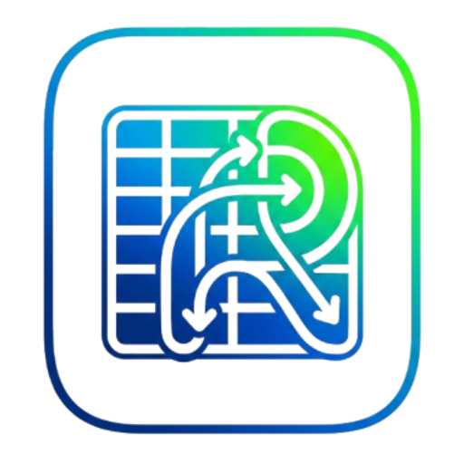

<div align="center">



# Table Relay

**A fast, multi-database desktop workbench** for browsing, querying, editing, and diagramming your data, with a built-in AI assistant.

One app for **MySQL, PostgreSQL, SQLite, MongoDB, Redis**, built with [Tauri](https://tauri.app) (Rust + React).

</div>

---

## Install

### macOS (Homebrew)

```bash
brew install --cask ByteLogicLabs/tap/table-relay
```

This taps `ByteLogicLabs/homebrew-tap` and installs **Table Relay.app** into `/Applications`. The cask clears the Gatekeeper quarantine flag for you on install, so the app opens without the "damaged" warning that unsigned builds normally trigger.

The cask always points at the newest release (it uses `version :latest` against the GitHub releases), so **install, reinstall, and upgrade all fetch the latest version** with no manual updates to the cask.

**Upgrade to the latest:**

```bash
brew update                          # refresh the tap
brew upgrade --cask table-relay      # upgrade if a newer release exists
```

If `brew upgrade` reports nothing to do but you want to force the newest build, reinstall (this always pulls the current latest):

```bash
brew reinstall --cask table-relay
```

**Uninstall:**

```bash
brew uninstall --cask table-relay
# add --zap to also remove app-data, caches, and preferences:
brew uninstall --zap --cask table-relay
```

> The cask is a small self-maintaining file in [`ByteLogicLabs/homebrew-tap`](https://github.com/ByteLogicLabs/homebrew-tap); it resolves the latest GitHub release on its own, so no per-release publishing step is needed. Builds are ad-hoc signed but not notarized.

### Other platforms

Download the installer for your OS from the [latest release](https://github.com/ByteLogicLabs/Table-Relay/releases/latest):

- **macOS** (without Homebrew): the `.dmg` (arm64 or x86_64). See [Installing a downloaded release](#installing-a-downloaded-release) for the one-time Gatekeeper step.
- **Windows**: the `.msi` or `-setup.exe`.

---

## Features

- **Data grid**: browse, filter, sort, and inline-edit rows. Editable JSON tree view for MongoDB documents.
- **SQL editor**: Monaco-based editor with schema-aware autocompletion, multi-statement execution, a query log, and a destructive-query warning before you run a `DELETE`, `UPDATE`, or `DROP`. Run the statement under the cursor or run all (Cmd/Ctrl+Enter / Cmd/Ctrl+Shift+Enter), format SQL/JSON, and load or save the query buffer to a file from the native **File** menu (Cmd/Ctrl+I to load, Cmd/Ctrl+S to save, Cmd/Ctrl+Shift+S to save as).
- **Schema editor**: create and alter tables, columns, indexes, and foreign keys. The app emits dialect-correct DDL per driver, with per-column data types and collation, searchable type/collation pickers, and table-level encoding/collation.
- **Diagrams**: auto-laid-out entity-relationship diagrams from your schema.
- **Realtime**: publish/subscribe against Redis Pub/Sub and Postgres `LISTEN`/`NOTIFY`.
- **Process list**: view and kill running queries/connections (where the driver supports it).
- **Import and export**:
  - **Import connections** from other clients so you do not re-enter every server by hand. Supported sources include TablePlus, DBeaver, Navicat, HeidiSQL, and another Table Relay export. A password prompt fills in any secrets the source file does not carry.
  - **Import data** from a `.sql`, `.csv`, or `.json` file.
  - **Export** a query result or a whole connection to CSV, TSV, JSON, NDJSON, Excel, or SQL INSERT statements, with a progress dialog and cancellation for large exports.
- **AI assistant**: chat about your schema and data with OpenAI, Anthropic, Google Gemini, any OpenAI-compatible endpoint (Ollama, Groq, LM Studio), a **fully local on-device model**, or a **CLI provider** (Claude Code, Codex, Gemini CLI, opencode, Kilo, or Antigravity) that runs against the coding agent you already have installed and logged in on your machine. Conversations and the chosen model/provider are saved per conversation and restored across restarts, and you can manage or bulk-delete chat history.
  - For the local model, Table Relay runs `llama.cpp` (`llama-server`) for you, with a built-in downloader for curated GGUF models (Qwen2.5-Coder 3B/7B/14B), so you can use the assistant offline with no API key and no data leaving your machine.
  - The assistant inspects schema freely, but **every query it runs is gated by an approval prompt**. With **per-operation permissions** you can auto-allow individually (Read, Write, Create/DDL, Delete) while destructive statements (no-`WHERE` deletes, `DROP`, `TRUNCATE`) always ask.
  - The tool loop auto-retries transient provider failures (network timeouts, rate limits, upstream 5xx) with backoff, and guards against runaway repeat calls.
- **MCP bridge**: Table Relay exposes its database tools over the Model Context Protocol, so an external MCP-capable client/agent can drive the same gated query surface.
- **SSH tunneling**: connect to any networked database (MySQL, PostgreSQL, MongoDB, Redis) behind a jump host (password or key auth), with trust-on-first-use host-key pinning, keepalive-kept-alive sessions, and connection reuse so tunnels are not re-handshaked on every operation. A small **SSH** badge marks tunneled connections in the rail. (SQLite is a local file, so it has no tunnel.)
- **Resilient connections**: a transparent reconnect supervisor rebuilds a dropped pool or SSH tunnel on the next query, with silent recovery for stale sockets and a "Reconnecting" badge only when a rebuild is genuinely needed.
- **Settings**: theme, default row limit, NULL display, Monaco editor preferences, destructive-query confirmation, restore-on-startup, and AI approval persistence, all in one dialog.
- **Built for speed**: lazy per-tab loading (only the table you are viewing fetches), in-memory caching of schema/structure/rows so switching tabs and connections is instant, parallel persistent connections, and a per-connection query gate that prevents pool stampedes.

## Supported databases

| Driver | Browse/Edit | SQL/Query | Schema editor | Diagram | Realtime | SSH tunnel |
|---|:---:|:---:|:---:|:---:|:---:|:---:|
| MySQL | ✅ | ✅ | ✅ | ✅ | - | ✅ |
| PostgreSQL | ✅ | ✅ | ✅ | ✅ | ✅ (`LISTEN`/`NOTIFY`) | ✅ |
| SQLite | ✅ | ✅ | ✅ | ✅ | - | - |
| MongoDB | ✅ | ✅ | ✅ | - | ✅ (change streams) | ✅ |
| Redis | ✅ | ✅ | - | - | ✅ (Pub/Sub) | ✅ |

Exact capabilities per driver are declared in each adapter's `manifest.toml` and drive what the UI exposes.

---

## Getting started

### Prerequisites

- **Node.js** 20+ (developed against 22.x)
- **Rust** 1.86+ and the Tauri prerequisites for your OS, see [tauri.app/start/prerequisites](https://tauri.app/start/prerequisites/) (Xcode CLT on macOS; `webkit2gtk`/`build-essential` on Linux; the C++ build tools plus WebView2 on Windows).

### Run in development

```bash
npm install
npm run tauri:dev
```

The first Rust build compiles all five database adapters and can take several minutes; subsequent builds are incremental.

> **AI is optional and configured in-app, not via environment variables.** For a hosted provider, open **Settings > AI Providers**, add a credential, and activate it (keys are stored locally on your machine, see [Security](#security)). For a **local model** you need no key at all: pick **Local Llama**, download a GGUF model from the built-in catalog, and Table Relay runs it on-device via `llama.cpp` (install the open-source [`llama.cpp`](https://github.com/ggerganov/llama.cpp) `llama-server` CLI first, for example `brew install llama.cpp`). For a **CLI provider**, log in to your coding agent (Claude Code, Codex, Gemini CLI, opencode, Kilo, or Antigravity) in your terminal as usual; Table Relay only invokes the binary you already authenticated and bills under your own account. There is no required `.env` file to run the app.

### Installing a downloaded release

This section is for **manual** downloads. If you installed via Homebrew (above), you can skip it: the cask clears the macOS quarantine flag for you.

Release builds are **not code-signed or notarized**, so the OS will warn you the first time you open the app.

**macOS**: you may see *"Table Relay is damaged and can't be opened"* or *"Apple cannot check it for malicious software."* This is usually Gatekeeper quarantining an unsigned download, not actual corruption. After dragging the app into `/Applications`, clear the quarantine flag once:

```bash
xattr -dr com.apple.quarantine "/Applications/Table Relay.app"
```

Then open it normally. If "damaged" still appears, confirm the build matches your Mac's architecture: a build made only for Apple Silicon will not run on an Intel Mac (and vice versa). Use a universal build to cover both (see the scripts below).

**Windows**: SmartScreen shows *"Windows protected your PC."* Click **More info > Run anyway**.

### Build a release bundle

```bash
npm run tauri:build
```

Produces a native installer/app for your platform under `target/release/bundle/`.

### Other scripts

| Command | What it does |
|---|---|
| `npm run dev` | Vite dev server only (frontend, no Tauri shell) |
| `npm run build` | Type-check and build the frontend bundle |
| `npm run lint` | `tsc --noEmit` type check |
| `npm run tauri:dev` | Run the full desktop app in dev mode |
| `npm run tauri:build` | Build the distributable desktop app |
| `npm run build:mac` | Build, ad-hoc sign, and package a `.dmg` for the host architecture |
| `npm run build:mac:universal` | Build a universal `.dmg` (Apple Silicon plus Intel) that runs on any Mac |
| `npm run build:mac:intel` | Build an Intel-only `.dmg` |

The `build:mac` scripts ad-hoc sign the app so it launches without the Gatekeeper "damaged" error, then assemble the `.dmg` with `hdiutil`. This is not notarization: a downloaded `.dmg` still needs the `xattr` step above on the receiving machine. For sharing to another Mac, prefer `build:mac:universal` so architecture is never the problem.

---

## Architecture

```
src/                  React + TypeScript UI (Vite)
  features/           One folder per workspace tab (data-grid, sql-editor, schema, diagram, realtime, ai-chat, ...)
  lib/                IPC wrappers, stores, Monaco/SQL helpers
  state/              Lightweight external stores (useSyncExternalStore)
src-tauri/            Rust backend (Tauri host)
  src/commands/       Tauri command surface (db, ai, store, rail)
  src/ai/             AI providers, streaming, tool-calling, approval flow, MCP bridge
  src/db/             Connection registry, reconnect supervisor, subscriptions
  src/store/          Local SQLite store (connection profiles, settings) via rusqlite
  adapter-api/        Shared `Adapter` trait, manifest, intent types
  adapter-ssh/        SSH tunnel crate (russh)
src-adapters/         One folder per database driver (backend crate + frontend hooks + manifest)
  {mysql,postgres,sqlite,redis,mongo}/
```

Each database is a self-contained adapter. To add a new one: drop a folder under `src-adapters/`, declare its capabilities in `manifest.toml`, implement the `Adapter` trait, list it in `src-tauri/adapters.toml`, and add the path dependency in `src-tauri/Cargo.toml`. `build.rs` generates the registration code at build time.

---

## Security

Table Relay is currently in **development mode**, and you should treat it accordingly:

- **Connection credentials and AI API keys are encrypted at rest.** They live in the app's local store, an AES-256-GCM encrypted SQLite snapshot (`store.db.enc` in your OS app-data directory). The encryption key is compiled into the app binary, so the file is protected against casual inspection and copy-off-disk, but **a key embedded in the binary is recoverable by a determined attacker**. A password-derived key or OS-keychain storage would be stronger and is still planned.
- The AI assistant can read your schema without prompting, but **all queries it executes require explicit approval** in the chat panel.
- CLI AI providers run against the agent you logged in yourself; Table Relay never reads, stores, or transmits those credentials and adds no free access, usage is billed under your own account.
- Be cautious holding credentials for sensitive production systems: at-rest encryption is in place, but the binary-embedded key and lack of OS-keychain integration mean this is not yet hardened for high-value secrets.

Do not commit `.env` files or any file containing real keys; the repo's `.gitignore` excludes `*.env`, but verify before pushing.

---

## License

[MIT](LICENSE) © 2026
</content>
</invoke>
