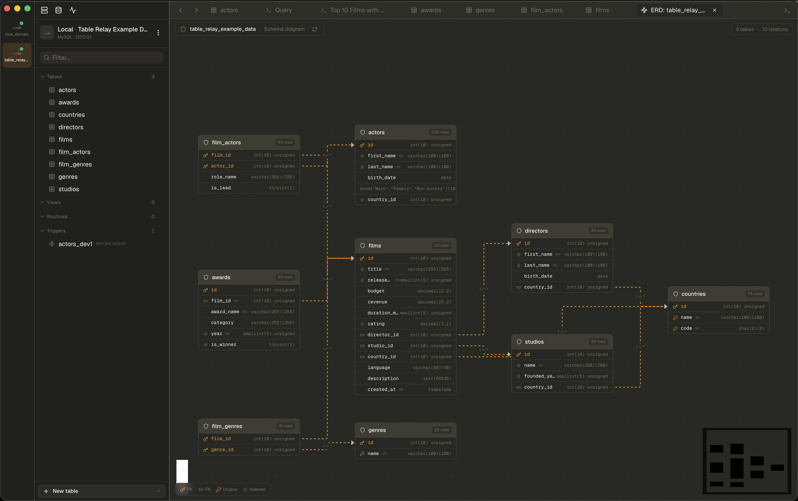

# Diagrams (ERD)

Table Relay generates interactive entity-relationship diagrams from your schema.
Available on **MySQL**, **PostgreSQL**, and **SQLite**.

## Open a diagram

- From a table's context menu in the sidebar, or
- Switch a data tab to **Diagram** view mode.

You can scope it to a single table's neighborhood or the whole schema.

## What you get

- Tables render as nodes listing their columns; foreign keys are drawn as
  directed edges between them.
- **Automatic layout** (dagre) arranges the graph, separating isolated tables
  from the main cluster.
- **Zoom, pan, center**, and a **mini-map** for navigating large schemas.
- **Refresh** to redraw after schema changes.

Relationships are inferred from declared foreign keys (`erd_inference` /
`foreign_keys` capability per driver).

## Related

- [Querying & editing data](querying-and-editing.md) - the schema editor that
  defines the tables and keys shown here
