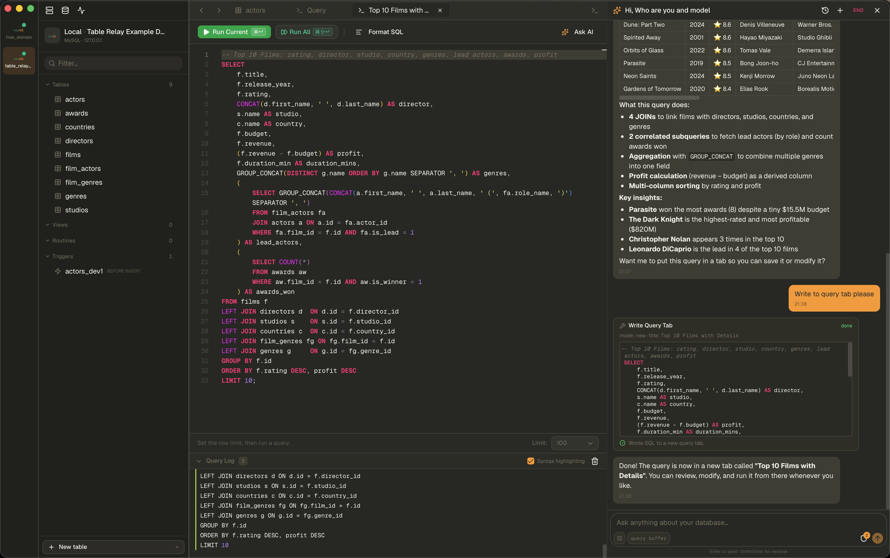
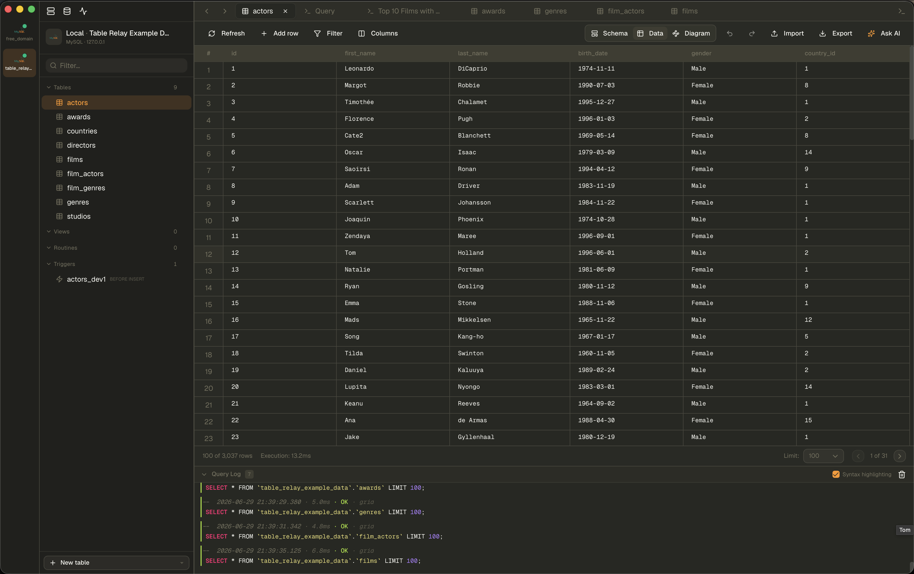
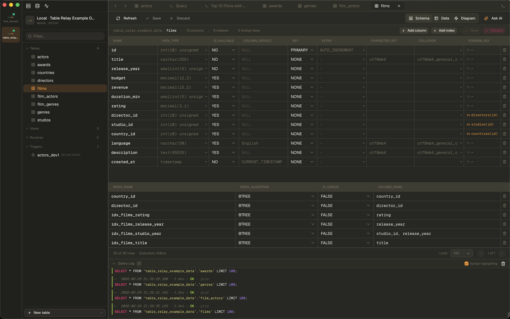

# Querying & editing data

## The SQL editor

A Monaco-based editor (the same engine as VS Code) with schema-aware
autocompletion. The exact label and language depend on the driver - it's a
**Mongo shell** for MongoDB and a **Redis shell** for Redis.

- **Run the statement under the cursor**: `Cmd/Ctrl+Enter`
- **Run all statements**: `Cmd/Ctrl+Shift+Enter`
- **Load a query file**: `Cmd/Ctrl+I`
- **Save the buffer**: `Cmd/Ctrl+S` · **Save as**: `Cmd/Ctrl+Shift+S`
- **Format** SQL/JSON from the toolbar.
- **Stop** a running query with the Stop button.

Other editor features:

- **Limit selector** in the footer caps `SELECT` result size.
- **Query log** records every statement with status, duration, and expandable
  errors. Before a `DELETE`, `UPDATE`, `DROP`, or `TRUNCATE`, a destructive-query
  warning shows the SQL and asks you to confirm (toggleable in Settings).
- **Export the result set** to CSV / JSON / SQL from the toolbar.
- Results are cached per tab, so switching tabs doesn't refetch.
- Toggle results between **table** and **JSON** view (where the driver supports
  JSON results).
- The **Sparkles** button hands the current query to the [AI assistant](ai-assistant.md).

## The data grid

Browse, filter, sort, and inline-edit rows.

- **Filter / sort** push down to the server where the driver supports it; build
  multi-condition filters with operators (`=`, `!=`, `<`, `>`, `LIKE`, `IN`,
  `IS NULL`, …).
- **Inline edit**: double-click a cell. Editors are type-aware (dropdowns for
  enums, date pickers, JSON editors, text areas for long strings). Pending edits,
  inserts, and deletes are staged and applied together; you can **discard** or
  **undo/redo** (`Cmd/Ctrl+Z` / `Cmd/Ctrl+Shift+Z` / `Cmd/Ctrl+Y`).
- **Set NULL** from a cell's context menu.
- **Copy / paste**: copy cells as CSV or a JSON array; paste rows to insert.
- **Columns**: hide/show and reorder; the left side can freeze on tall grids.
- **Pagination**: row limit (50 / 100 / 250 / 500 / 1000, default in Settings)
  with prev/next and a total-rows count.
- **Export** the table to CSV / JSON / SQL (with options like compression and
  part-file splitting for large tables) - see [Import & export](import-export.md).
- **View modes**: a data tab can switch between **Table**, **JSON**,
  [**Diagram**](diagrams.md), and **Schema** (structure editor).
- **MongoDB** documents also have an editable **JSON tree view**.

## Schema editor

Create and alter tables, columns, indexes, and foreign keys without writing DDL
by hand. Table Relay emits dialect-correct DDL per driver, with per-column types
and collation, searchable type/collation pickers, index algorithm selection,
foreign-key `ON DELETE`/`ON UPDATE` actions, and table-level encoding/collation.
Changes are staged and applied as a batch. What's available depends on the
driver's declared capabilities.

## More surfaces

These have their own pages:

- [Diagrams (ERD)](diagrams.md)
- [Realtime](realtime.md) - Pub/Sub, LISTEN/NOTIFY, change streams
- [Process list](process-list.md) - monitor and kill server processes
- [Routines & triggers](routines-and-triggers.md)

## Related

- [AI assistant](ai-assistant.md) - let the assistant help write/run queries (with approval)
- [Keyboard shortcuts](keyboard-shortcuts.md)
